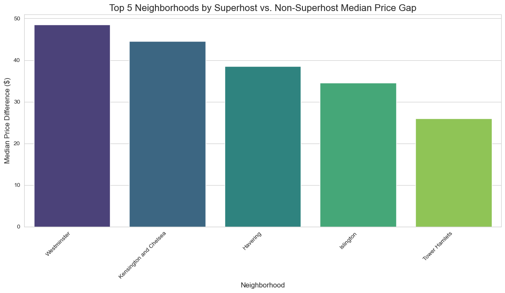
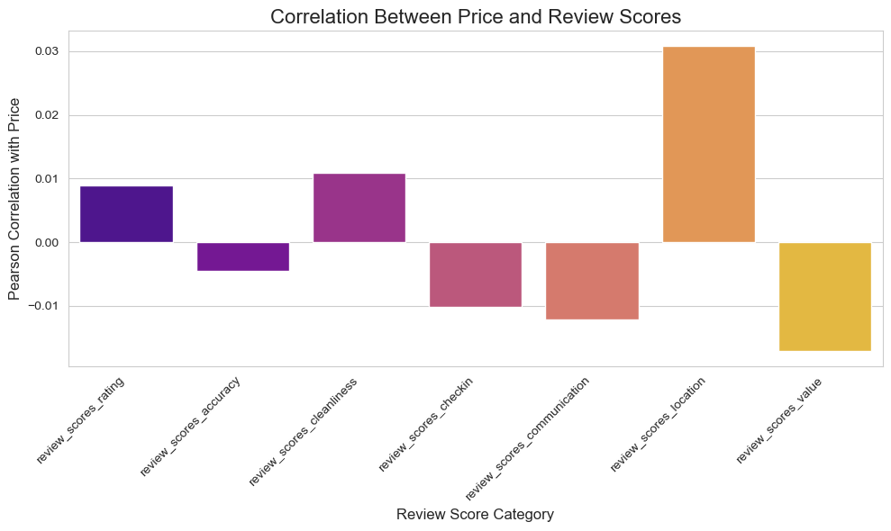
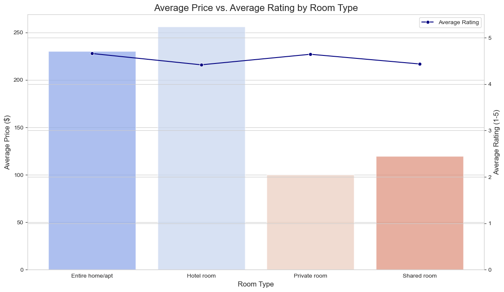

# Airbnb Data Analysis Project

This project provides an analysis of a reduced Airbnb dataset, focusing on pricing, review scores, and listing types. All the analysis and visualizations are contained within the Jupyter Notebook `airbnb_data_analysis.ipynb`.

## Analysis Overview

The notebook tackles three main challenges:
* **Superhost Pricing Gap:** Identifies the neighborhood with the largest median price difference between Superhosts and non-Superhosts.
* **Price-Review Correlation:** Determines which review score metric is most strongly correlated with the listing price.
* **Room Type Analysis:** Compares the average price and average rating across different room types.





## How to Run This Project

Follow these steps to set up and run the analysis on your own machine.

## Data Sources
The datasets for this analysis are sourced from the following public URLs. If you are running this project locally, you must download them first.

* [**Listings Data** (`listings_2_reduced.csv`)](https://storage.googleapis.com/public-data-337819/listings%202%20reduced.csv)
* [**Reviews Data** (`reviews_2_reduced.csv`)](https://storage.googleapis.com/public-data-337819/reviews%202%20reduced.csv)

### 3. Install Required Libraries

You will need a few Python libraries to run the notebook. You can install them using pip:

```bash
pip install pandas matplotlib seaborn jupyter

### 3. Install Required Libraries

```
In your terminal or command prompt, navigate to your project folder and start Jupyter Notebook:

```bash
jupyter notebook
```
